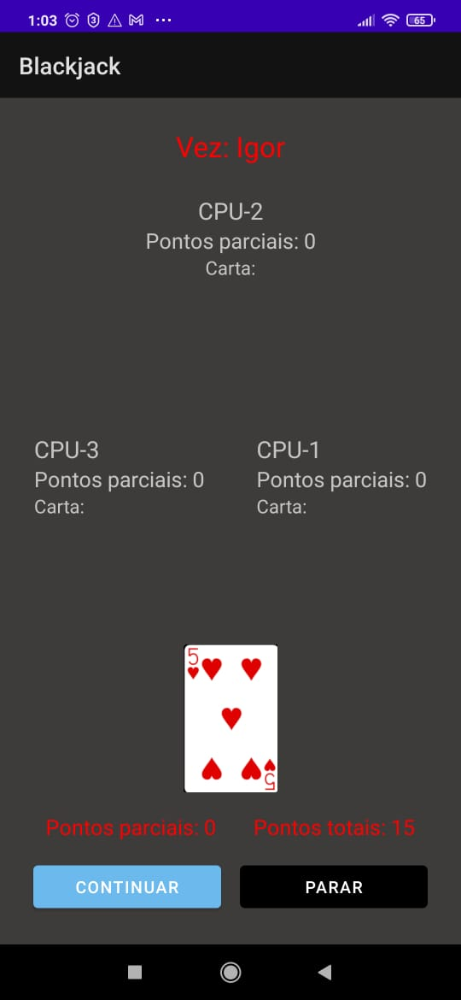
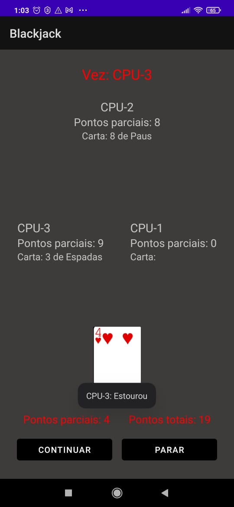
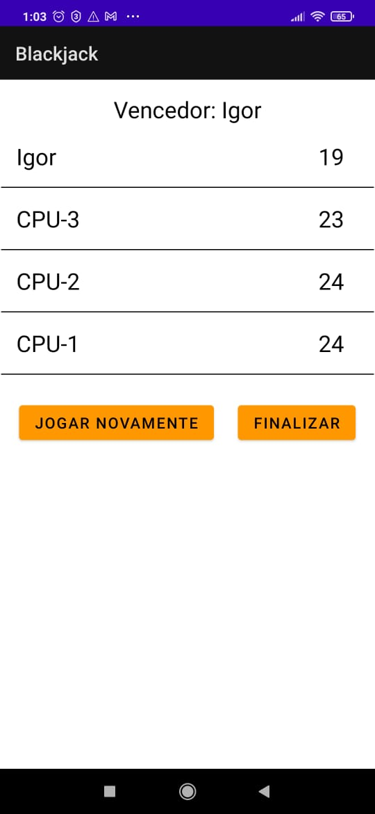
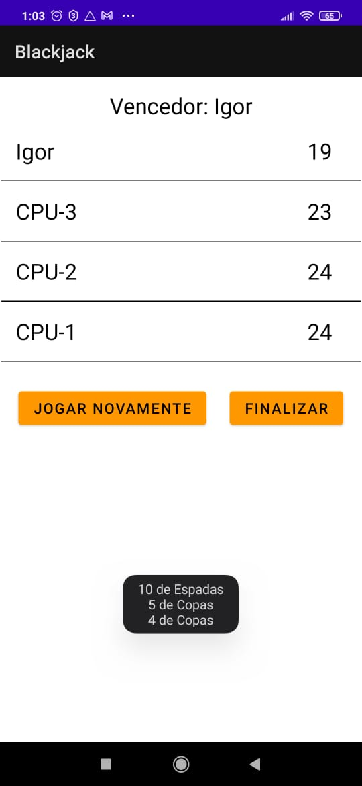

# BlackJack
 Este projeto tem como objetivo simular o jogo blackjack, mais conhcecido como 21. Neste jogo temos 4 jogadores, 1 jogador humano e 3 cpus. Quem conseguir a pontuação mais próxima de 21 vence a partida, se dois ou mais tiverem a melhor pontuação é declarado empate, se todos ultrapassarem 21, também é considerado empate.

## Instalação

A instalação é bem simples, basta fazer o download do apk disponível em -> app/release/app-release.apk.

É recomendado utilizar o night mode, se o seu celular tiver esta opção, pois o layout deste projeto não foi feito para a utlização do modo claro, logo a experiência vai ser melhor utilizando o modo escuro.

Neste projeto, a target api esta definida como 31, porém não foram utilizados recursos que comprometam a utilização em apis mais antigas.
## Sobre o app:

<ul>
    <li>Cartas iniciais -> Inicialmente são distribuidas duas cartas para cada jogador;</li>
    <li>Ordem dos jogadores -> A ordem é aleatória, ou seja, as vezes você começa, e as vezes qualquer uma das três cpus podem começar jogando;</li>
    <li>Pontos -> Cada participante, player ou cpu, possue seus pontos parciais, que dizem respeito a soma do valor de suas cartas excluindo as iniciais, e seus pontos totais que são a soma de todas as cartas;</li>
    <li>Compra -> Todo jogador é obrigado a comprar mais uma carta, caso seus pontos totais sejam menores que 16;</li>
    <li>Estouro ou 21 -> Um mensagem é disparada quando algum dos jogadores estora ou atinge 21.</li>
</ul>

## Exemplos

Abaixo o botão de parar esta preto, isto significa que ele esta desativado, isso aconteceu porque o jogador tem menos de 16 pontos totais, ou seja, ele é obrigado a continuar. 

A seguir a cpu-3 estourou, portanto uma mensagem de aviso foi disparada.

Contudo, após o jogo terminar, somos direcionados para a tela de vencedores, nela poderemos ver quem ganhou ou se foi empate,
além disso poderemos ver a pontuação total de todos os jogadores e também as cartas que eles compraram.

Ao clicar em um jogador, as cartas recebidas pelo mesmo são mostradas.

Porfim o botão finalizar fecha o app e o botão jogar novamente inicia outra partida.

